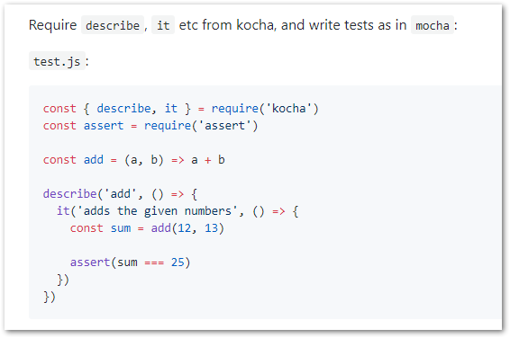
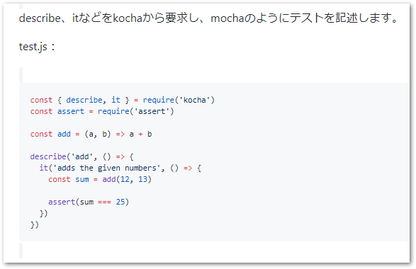

# konnnyaku

Google Chrome 翻訳機能向けのタグチェンジャー konnnyaku (蒟蒻) です。

TODO: Bookmarklet置き場はこちら。

## どういうものか

例えば、以下のページを翻訳してみましょう。

 https://github.com/kt3k/kocha 



これを普通に翻訳すると、、、


あらま！コードの中身が翻訳されてしまいました。最初の文も全く分からないですね。

------

そこで蒟蒻を使うと・・？



最初の文が読めるようになってます！素晴らしい👏

コードの中身も、少しフォントが小さくなってしまいましたが、コードのまま維持されています。

Chrome では　`code` タグに囲まれていると、翻訳をスキップする作りになっているので、蒟蒻はこの辺りのタグ変更をうまく調整しています。


## 使い方

以下のページにある Bookmarklet をご利用ください。対象のページで実行後、翻訳を起動してください。

TODO: Bookmarklet置き場はこちら。


## 注意点

上手く動かないページもよくあります。仮想スクロールを使っていたり、汎用化しにくいタグを使っているページなどは対応出来ていません。


# Development

```shell
npm install
# Modify konnnyaku.js and package.json (version).
node ./build.js
```
