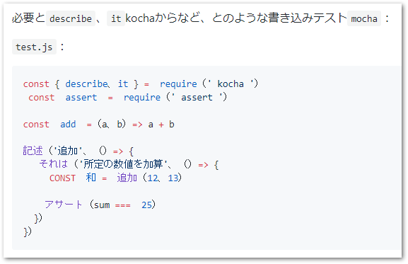

# konnnyaku

Google Chrome 翻訳機能向けのタグチェンジャー konnnyaku (蒟蒻) です。


<!-- Bookmarklet Start -->  
<a href='javascript:(function()%7B%22use%20strict%22%3BArray.from(document.querySelectorAll(%22pre%22)).filter(function(r)%7Breturn%20r.innerHTML.match(%2F%3C.*%3E%2F)%7C%7Cr.innerHTML.match(%2F%5Cn%2F)%7D).forEach(function(r)%7Breturn%20r.outerHTML%3D%22%3Ccode%3E%22%2Br.outerHTML%2B%22%3C%2Fcode%3E%22%7D)%2CArray.from(document.querySelectorAll(%22pre.geist-overflow-scroll-y%22)).forEach(function(r)%7Breturn%20r.outerHTML%3D%22%3Ccode%3E%22%2Br.outerHTML%2B%22%3C%2Fcode%3E%22%7D)%2CArray.from(document.querySelectorAll(%22code%2C%20.editor-wrapper%22)).filter(function(r)%7Breturn!r.innerHTML.match(%2F%3C.*%3E%2F)%7D).forEach(function(r)%7Breturn%20r.outerHTML%3Dr.outerHTML.replace(%2Fcode%2Fg%2C%22span%22)%7D)%3B%7D)()'>蒟蒻v1.0.0</a>


[test](javascript:(function(\)%7B%22use%20strict%22%3BArray.fro\(document.querySelectorAll(%22pre%22\)\).filter(function(r\)%7Breturn%20r.innerHTML.match(%2F%3C.*%3E%2F\)%7C%7Cr.innerHTML.matc\(%2F%5Cn%2F\)%7D\).forEach(function(r\)%7Breturn%20r.outerHTML%3D%22%3Ccode%3E%22%2Br.outerHTML%2B%22%3C%2Fcode%3E%22%7D\)%2CArray.from(document.querySelectorAll(%22pre.geist-overflow-scroll-y%22\)\).forEach(function(\r)%7Breturn%20r.outerHTML%3D%22%3Ccode%3E%22%2Br.outerHTML%2B%22%3C%2Fcode%3E%22%7D\)%2CArray.from(document.querySelectorAll(%22code%2C%20.editor-wrapper%22\)\).filter(function(\r)%7Breturn!r.innerHTML.match(%2F%3C.*%3E%2F\)%7D\).forEach(function(\r)%7Breturn%20r.outerHTML%3Dr.outerHTML.replac\(%2Fcode%2Fg%2C%22span%2\2)%7D\)%3B%7D\)(\)\)
<!-- Bookmarklet End -->


## どういうものか

例えば、以下のページを翻訳してみましょう。

 https://github.com/kt3k/kocha 


これを普通に翻訳すると、、、



あらま！コードの中身が翻訳されてしまいました。最初の文も全く分からないですね。

------

そこで蒟蒻を使うと・・？


最初の文が読めるようになってます！素晴らしい👏

コードの中身も、少しフォントが小さくなってしまいましたが、コードのまま維持されています。

Chrome では　`code` タグに囲まれていると、翻訳をスキップする作りになっているので、蒟蒻はこの辺りのタグ変更をうまく調整しています。


## 使い方

以下の Bookmarklet をご利用ください。対象のページでクリック後に、翻訳を起動してください。


<!-- Bookmarklet Start -->  
<a href='javascript:(function()%7B%22use%20strict%22%3BArray.from(document.querySelectorAll(%22pre%22)).filter(function(r)%7Breturn%20r.innerHTML.match(%2F%3C.*%3E%2F)%7C%7Cr.innerHTML.match(%2F%5Cn%2F)%7D).forEach(function(r)%7Breturn%20r.outerHTML%3D%22%3Ccode%3E%22%2Br.outerHTML%2B%22%3C%2Fcode%3E%22%7D)%2CArray.from(document.querySelectorAll(%22pre.geist-overflow-scroll-y%22)).forEach(function(r)%7Breturn%20r.outerHTML%3D%22%3Ccode%3E%22%2Br.outerHTML%2B%22%3C%2Fcode%3E%22%7D)%2CArray.from(document.querySelectorAll(%22code%2C%20.editor-wrapper%22)).filter(function(r)%7Breturn!r.innerHTML.match(%2F%3C.*%3E%2F)%7D).forEach(function(r)%7Breturn%20r.outerHTML%3Dr.outerHTML.replace(%2Fcode%2Fg%2C%22span%22)%7D)%3B%7D)()'>蒟蒻v1.0.0</a>
<!-- Bookmarklet End -->


## 注意点

上手く動かないページもよくあります。仮想スクロールを使っていたり、汎用化しにくいタグを使っているページなどは対応出来ていません。


# Development

```shell
npm install
# Modify konnnyaku.js and package.json (version).
node ./build.js
```
